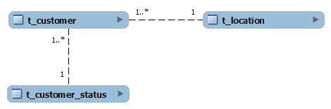
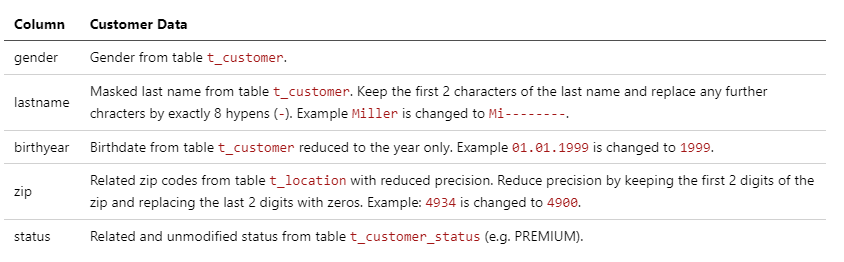

# Introduction

The figure shows the SQLite database model of an application with 3 tables and 2 relationships:

Data must be anonymized before the data can be passed on to a third-party provider for statistical analysis. Before you start, verify the integrity of the downloaded database file in the resource section by calculating and comparing the MD5 checksum.

MD5 (c3-database-initial.db) = d3dea3059021a0b70430e1edbe5b9b4b

# Goal and Task

Create a CSV file with the anonymized data of all customers from the database. The CSV file must contain the following columns as header and the processed data in its rows.

# Submission

Submit a ZIP archive containing the CSV file with the anonymized data and a written report as PDF document with a brief technical description of your approach (including information about methods, tools, commands, scripts etc. used).
