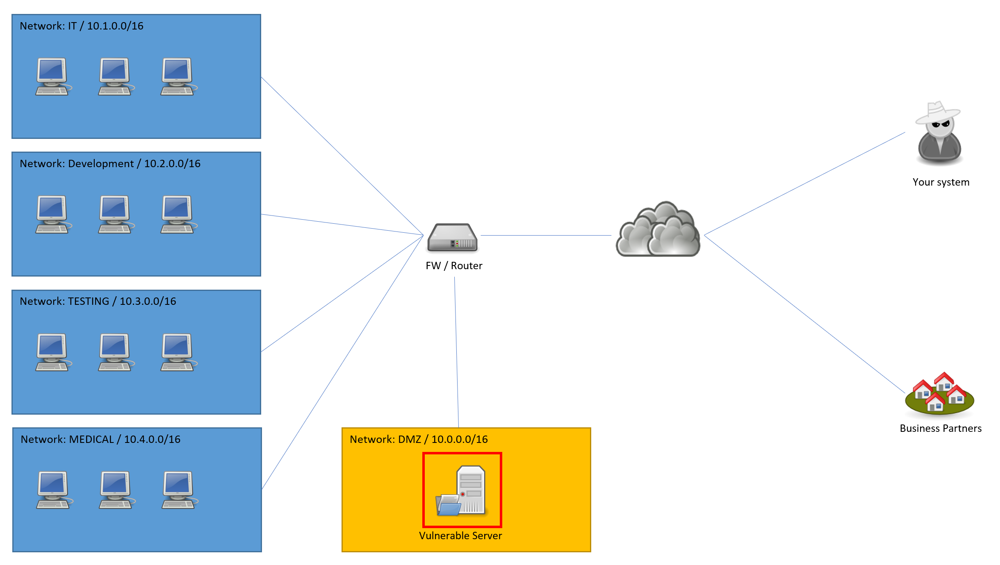

## Introduction
 
A security analyst has performed a Nessus Vulnerability Scan of a network and sent an urgent report to you. He claims that there is a server which is a huge security issue for your network and should be taken offline immediately. The concerned server turns out to be critical for your operations and cannot be turned off without causing a major business impact. It is used to exchange medical information with approximately 200 business partners around the country.





The firewall in place applies the following rules:

```
# Network DMZ: 10.0.0.0/16
# Network IT: 10.1.0.0/16 (used by System Administrators only)
# Network DEVELOPMENT: 10.2.0.0/16 (used by Software Developers)
# Network TESTING: 10.3.0.0/16 (used by Developers and Medical Professionals for testing)
# Network MEDICAL: 10.4.0.0/16 (used by Medical Employees)

src 10.1.0.0/16 dst 10.0.0.0/16 ACCEPT
src 0.0.0.0/0 dst 10.0.0.131/32 proto tcp dport 21,5000-65535 ACCEPT
src 0.0.0.0/0 dst 10.0.1.17/32 ACCEPT
default policy DROP
```

## Goal & Tasks

Analyze the given Nessus report as well as the selection of issues in the given report template in the resources section. Complete the report template providing the following information:

- Prioritize all listed issues in the given template and give a reason for your prioritization
- List 3 immediate actions that should be taken in the given scenario
- List 3 mid- or long-term actions that should be taken in the given scenario

Make sure to weigh business needs against technical needs and verify your results using the machine provided in the resource section.
