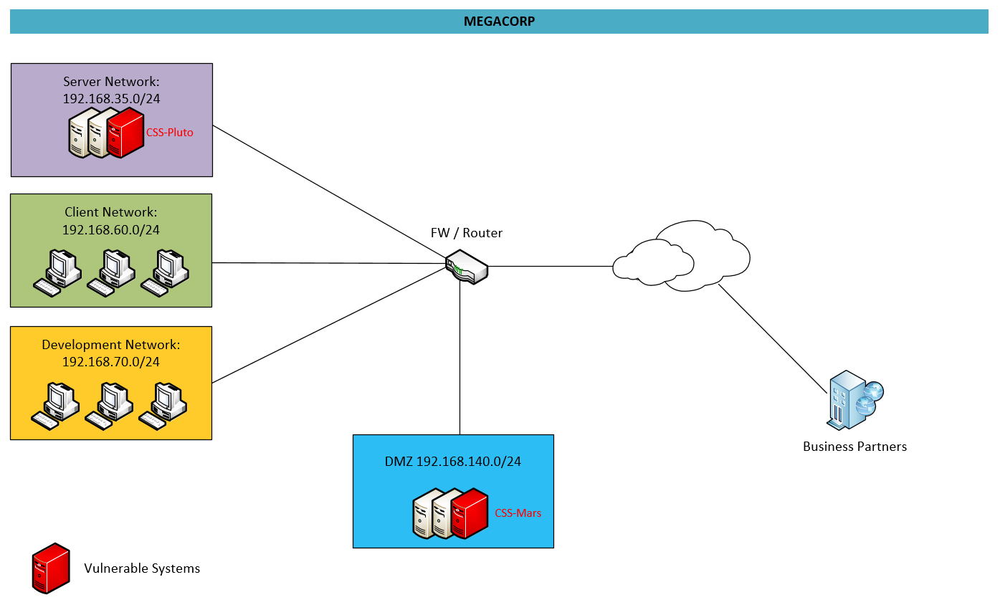

## Introduction

A security analyst has performed a Nessus Vulnerability Scan of a network and sent an urgent report to you. He has found two systems that have various vulnerabilities.

## Goals and Tasks

Perform the following tasks by analyzing the given Nessus reports and network architecture. Answer to all questions in a written report.

- Describe a maximum of 3 different actions (which are unintended by MEGACORP) an attacker could perform by exploiting the critical vulnerability on the Exchange Server (Mars)?
- Describe a maximum of 3 different actions (which are unintended by MEGACORP) an attacker could perform by exploiting the critical vulnerability on the Domain Controller (Pluto)?
- Under what technical circumstances is the critical vulnerability on the Domain Controller (Pluto) most problematic?
- List a maximum of 2 different immediate actions be taken in the given scenario.
- List a maximum of 3 different mid- or long-term actions be taken in the given scenario.
    Select an existing vulnerability of the "High" or "Medium" category on Mars and briefly describe how the chosen vulnerability can be closed.

## Submission

Submit a written report as PDF document with your answers. Make sure that your answers can be clearly assigned to the question numbers in the goal and task section.
