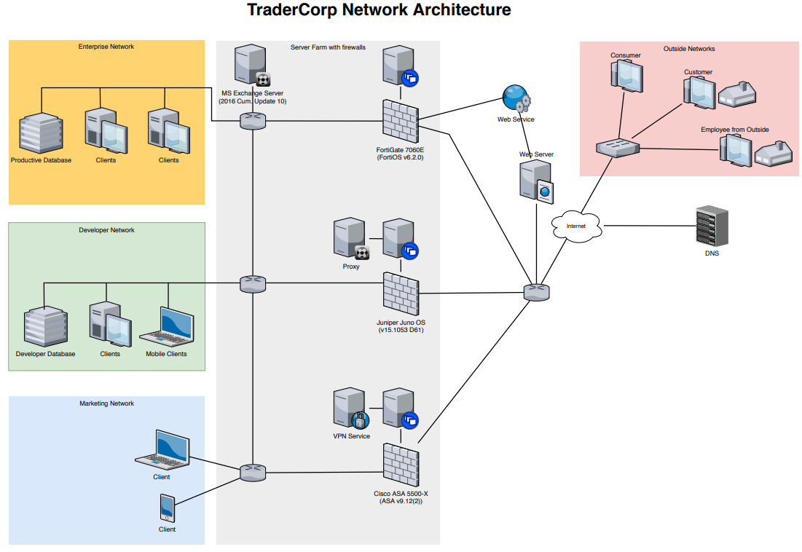

The CIO of TraderCorp has read an article about a security issue in Juniper devices knowing that the corporate network is using a Juniper firewall. He asked you to take a look at the advisory and to define the next steps.
Goal & Tasks

Read the following advisory and bring it into context of TraderCorp's network. Formulate a reply to the CIO on the basis of the provided template in the resources section. Your reply should contain:

	- 2 different vulnerabilities detected in the network
	- 2 different general architectural issues in the network
	- 2 different immediate actions as response to address the vulnerabilities
	- 2 different future actions to improve the situation within the next year

### Submission

Written reply to the CIO as PDF document containing the information required in the goal section.
